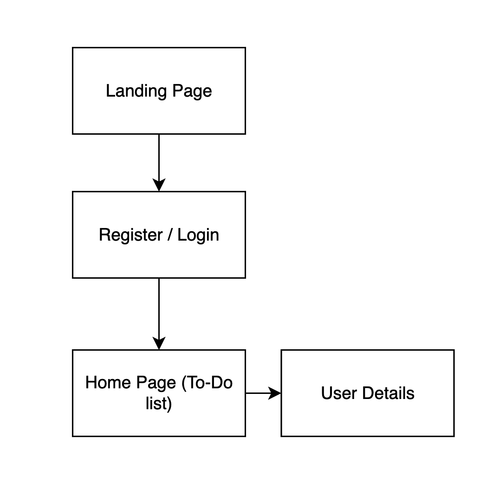

Software Requirement Specifications for

# OmniFocus

Version 1

### Prepared by Flynn Stevens

-------------------------------------

# Table of contents

1. [Introduction](#Introduction)
   1. [Purpose](#Purpose)
   2. [Requirements](#Requirements)
   3. [Team Members](#Team)
2. [Design](#Design)
1. [Site Map](##Sitemap)
2. [Data Flow Diagram](##DFD)
3. 

-----------------------------------------

# Introduction

# Purpose

OmniFocus is a simple to-do list web application. It features a simple log-in and register page, a page with the users to-do list, and a page where the user can view and edit their personal details. The app will be accessible via web for both mobile and PC users and provide a functional and responsive on any device.

# Requirements

The requirements for this web application are as follows:

- Minimum of four pages.
- Must use Firebase as a database.
- Be as responsive as possible.
- Must use Heroku.

# Team

## Keith Jhaeron Cayatoc (Team Leader)

UI / UX Designer

## Tristan Bulmer

Back-end Engineer

## Jackson Hayes

Front-end Engineer

## Flynn Stevens

Documentation Manager / Testing

# Design

# Site map

# DFD
